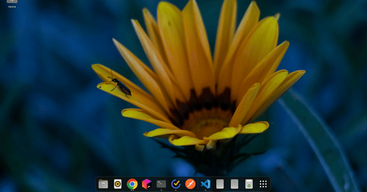

<p align="center">
    
</p>

---

### setup
Please ensure you have [nodejs intalled](https://nodejs.org/en/download/package-manager). [nvm](https://github.com/nvm-sh/nvm) is a popular option to manage multiple nodejs versions. Once you have cloned the project, `cd` into the project directory and if you have [nvm](https://github.com/nvm-sh/nvm) installed run `nvm use` to install the identical nodejs version. Once done, install the project  dependencies:
```bash
$ npm install
```
Once you've installed the dependencies execute the following to run the project:
```bash
$ npm run start
```

### todos
* file searching! next most imp item.
* for queries which don't map to app or file -> open in default browser?
* other interesting queries?
* just return all the installed files and have them as command items? Instead of fetching score on each query change? The filtering logic is done on the rendering side though in this case. Main process can multithread but rendered cannot?
* startup is noticeably slow, the installed packages portion. Make it faster using worker threads? Also does it need recomputing on every startup?
* theme: toggle b/w light and dark mode, and default should be based on system (would require communicating sys theme info from main -> renderer proc)
* still some apps which should be filtered out, .desktop doesn't necesarrily equate to exec'able or installed?
* dpkg is missing .desktop files within the local dir?
* optimize fuzzy matcher via trying out different scorers
* dameon to orchestrate python based reqs via main process.
* sqlite when things become a pain to store in files?
* still seeing a open '60' error in toSeek, main process. Not handling a promise correctly?
* ~~store .desktop info when checking /usr/share/apps folder and cache the info rather than fetching each time~~
* ~~how to fetch icons cleanly? there must be some ds storing all the app icon info on the system.~~
* ~~ensure search results cleared on backspacing into empty query~~
* ~~navigate to results and set focus using arrow keys or nums?~~
* ~~use the command shadcn component~~
* ~~make sure the searchresult key is not arr index.~~
* ~~Need to get rid of python since the usage is trivial. On looking into the bundling process, integrating python would require including py binaries with the app leading to a fat deb file.~~