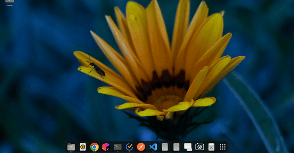

    

---

### todos
* startup is noticeably slow, the installed packages script I think.
* theme: toggle b/w light and dark mode, and default should be based on system (would require communicating sys theme info from main -> renderer proc)
* still some apps which should be filtered out, .desktop doesn't necesarrily equate to exec'able or installed?
* dpkg is missing .desktop files within the local dir?
* optimize fuzzy matcher via trying out different scorers
* local py server running listening to reqs from be?
* sqlite when things become a pain to store in files?
* how do I bundle the py scripts with electron? Does this work with auto-updating?
* still seeing a open '60' error in toSeek, main process. Not handling a promise correctly?
* ~~store .desktop info when checking /usr/share/apps folder and cache the info rather than fetching each time~~
* ~~how to fetch icons cleanly? there must be some ds storing all the app icon info on the system.~~
* ~~ensure search results cleared on backspacing into empty query~~
* ~~navigate to results and set focus using arrow keys or nums?~~
* ~~use the command shadcn component~~
* ~~make sure the searchresult key is not arr index.~~