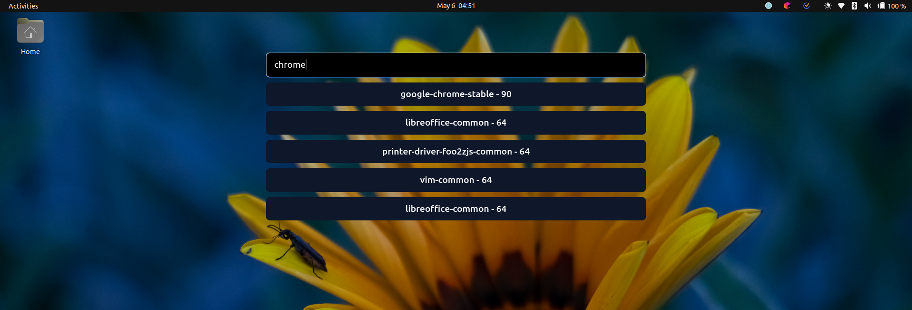

    <h2>bringing spotlight search to linux</h2>
  

---

### todos
* navigate to results using arrow keys or nums?
* how to fetch icons cleanly? there must be some ds storing all the app icon info on the system. (wip)
* the fuzzy matcher isn't great, "chro" yields chrome as an entry
* make sure the searchresult key is not arr index.
* local py server running listening to reqs from be?
* sqlite when things become a pain to store in files?
* how do I bundle the py scripts with electron? Does this work with auto-updating?
* ~~store .desktop info when checking /usr/share/apps folder and cache the info rather than fetching each time~~
